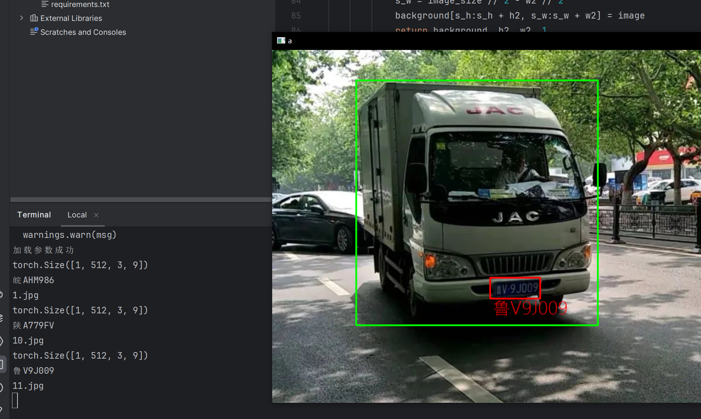
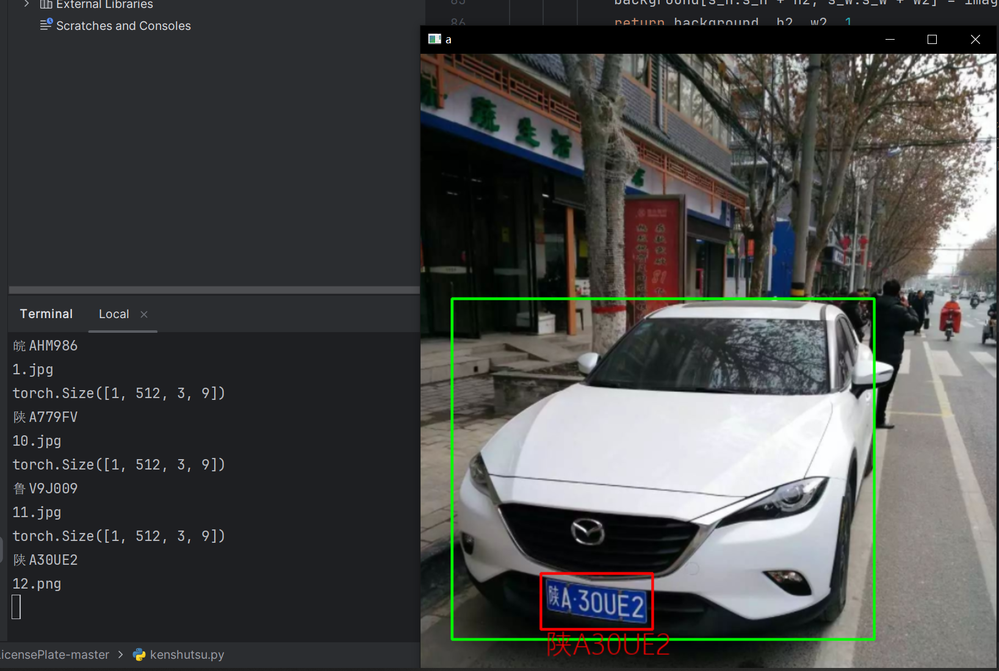

## 计算机毕业设计--基于深度学习的车牌检测识别算法

#### Abstract

目前机器学习的替代者深度学习（卷积神经网络）基于卷积神经网络，设计一个基于深度学习的车牌检测识别系统，用于本科毕业论文可以说是非常合适的，这篇博文记录的就是一篇本科毕业设计所用到的模型算法，训练这个代码（**在RTX4090上训练中等参数的Model大概只需要2个小时（时长不止由显卡配置决定，还取决于你选择的参数大小）**），只需要提供你想检测的包含车牌的图片（任何位置、角度都可以），就可以得到图片中车牌位置的标记和车牌号码的输出。
**作者联系方式：VX：Accddvva，QQ：1144968929**

- **概述**
  本项目是基于深度学习的车牌识别，其中，车辆检测网络直接使用YOLO侦测。而后，才是使用网络侦测车牌与识别车牌号。车牌的侦测网络，采用的是resnet网络，网络输出检测边框的仿射变换矩阵，可检测任意形状的四边形。车牌号序列模型，采用transformer模型，输出车牌号序列。训练数据集使用公开数据集，测试集使用实地拍摄的照片。

- 在训练检测模型的时候，使用数据增强算法，来加强检测的能力。车牌号的序列识别，直接使用程序生成的车牌图片训练，并佐以适当的图像增强手段。模型的训练直接采用端到端的训练方式，输入图片，直接输出车牌号序列，并将车牌号打印在原始图片上。

### 需要具备的电脑配置：

- 如果你要自己训练，那首先你需要拥有一台搭载了NVIDIA系列显卡的电脑，A卡不行，需要安装CUDA计算环境，以及pytorch和miniconda。

### 代码使用方法：

- 代码在LP_Detect文件夹里

- 运行python detect_train.py 训练代码
- 运行python kenshutsu.py 测试

### 有问题联系作者：

- **如果需要帮忙训练或者搭建环境，请看本文末尾**
- VX：Accddvva
- QQ：1144968929

### 训练好的模型展示！

- **以下的所有图片，是我在公开的数据集中训练了2个小时的模型，目的只是为了展示效果(如果你看不到图，那是因为你没开梯子)**

项目环境搭建：￥80rmb

**计算机专业在读硕士团队，接本科毕业设计、论文定制，主要擅长深学习方面的各种算法模型设计**

### 其他毕业设计

- 点开作者github主页浏览即可

### **联系QQ：1144968929 或 VX：Accddvva**	
