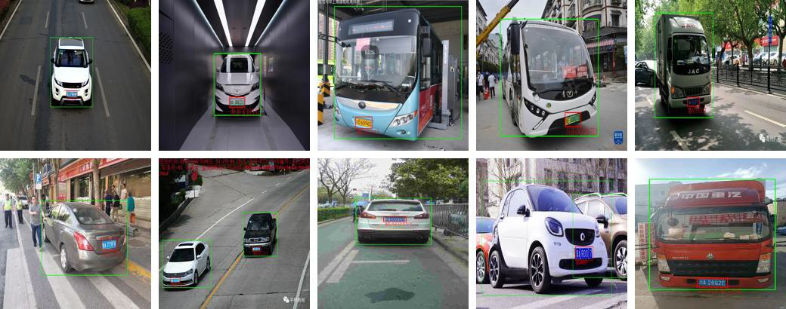
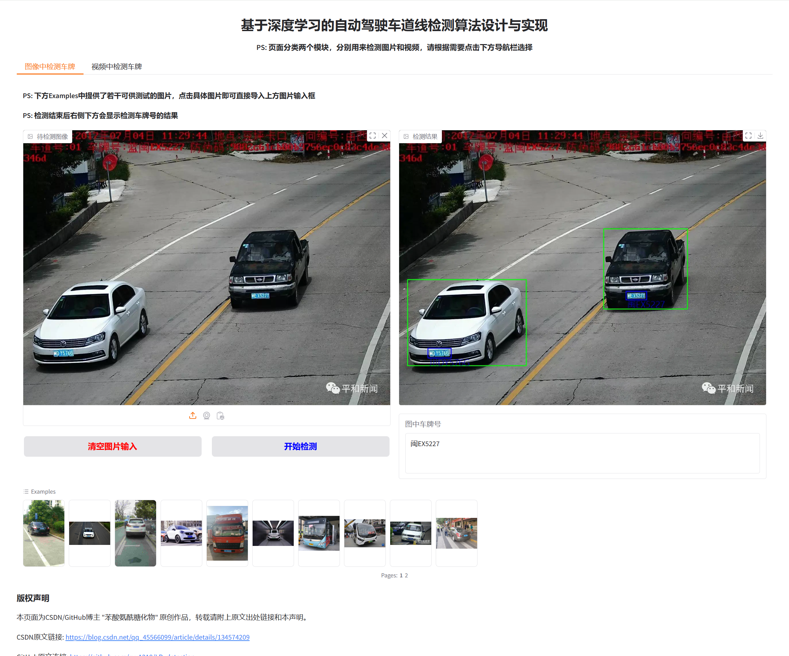
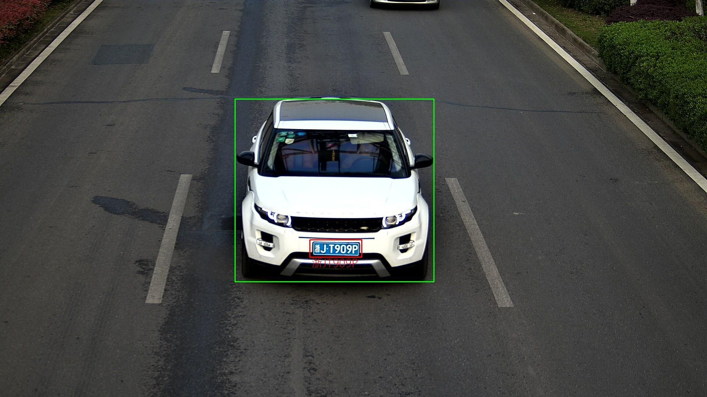
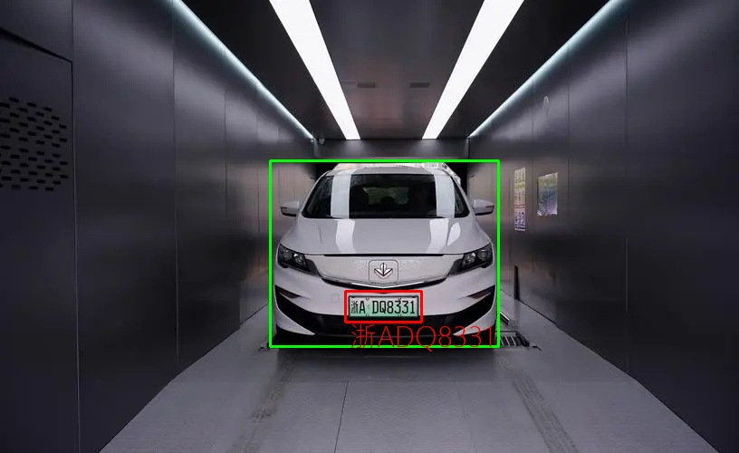
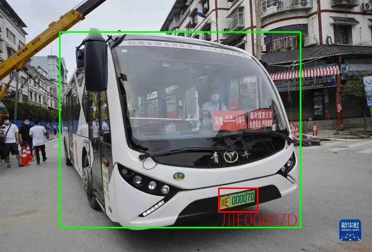
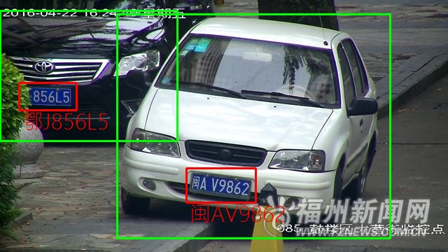

# 计算机毕业设计--基于深度学习的车牌检测与识别算法

**我的CSDN中还有其他方向的深度学习毕业设计项目，例如图像破损修复，照片色彩增强，划痕检测，视频异常检测、车牌识别、目标检测等，具体参考👇**

[深度学习方向毕业设计](https://blog.csdn.net/qq_45566099/category_12507289.html)

## :sparkles: Demo



<hr>


## :sparkles: 车牌识别（图片+视频）在线体验连接

👇

 **Web端在线体验地址：**:white_check_mark:[访问这里进行车牌识别在线体验](zxxserver.e3.luyouxia.net:14485):white_check_mark:

**在线体验地址集成了图片识别和视频检测，点击页面下方页面选项即可分别体验！在网页下方提供了若干输入样例，点击样例自动填充到相应位置后即可点击开始修复查看效果。**

**注意：** 修复第一张图的时候耗时较长，大约10秒左右。从第二张图开始，速度就会快起来，大约5秒左右一张（这主要是因为为了节约服务器资源，第一次启动的时候模型需要加载进显卡中）



<hr>

## 介绍

&emsp;本项目利用深度学习（卷积神经网络）设计了一个基于深度学习的车牌检测识别系统，非常适合作为本科毕业论文的研究课题。该系统提供两种检测方式：一种是对上传的图片进行车牌检测识别，另一种是通过视频流自动识别车牌和车牌信息。只需提供包含车牌的图片（无论位置或角度如何），系统即可标记图片中的车牌位置并输出车牌号码。如果你有摄像头，可以通过训练好的模型调用摄像头进行动态车牌监测，或者将.mp4格式的视频文件输入模型，模型将返回标记好车牌位置的图片并输出检测到的车牌号码。

&emsp;具体来说，车辆检测网络采用了**YOLOv7**模型进行检测，而车牌检测网络则使用基于**ResNet与注意力机制**改进的模型，该模型输出检测边框的仿射变换矩阵，可检测任意形状的四边形。车牌号码序列模型由**Transformer构建的生成式网络**实现。训练数据集使用公开数据集，而测试集则使用实地拍摄的照片。

&emsp;在训练检测模型时，使用了数据增强方法以增强模型的泛化能力。对于车牌号码的序列识别，使用程序生成的车牌图片进行训练，并结合适当的图像增强手段。模型训练采用端到端的方式，输入图片后直接输出车牌号码序列，并将车牌号码打印在原始图片上。

<hr>


## :rocket: 算法获取

- GitHub链接：[GitHub链接](https://github.com/zxx1218/LP_detection)
- Gitee连接：[Gitee](https://gitee.com/zxx1218/LP_detection-gitee)

PS：如果通过Github访问项目，请不要通过“加速通道”访问，因为加速通道中的项目版本比较老

### 运行要求

- 运行算法与Web前端需要 Python >= 3.8
- 运行GUI界面需要下载QT编译器 5.14.2 版本
- 建议使用带有nvidia系列的显卡（比如说1060、3050、3090都是nvidia系列的）

<hr>


## :zap:开始

#### 环境配置（推荐使用conda安装环境）

```
# 从github上Clone项目
git clone https://github.com/zxx1218/LicensePlateDetection.git

# 使用conda创建环境
conda create -n py39 python=3.9 -y
conda activate py39

# 安装依赖
pip install -r requirements.txt 
```

## 检测展示：

在视频中检测车牌：

- 由于Github上传视频限制，请移步至我的CSDN观看：https://blog.csdn.net/qq_45566099/article/details/134574209

使用模型检测单张图片：










<hr>


## 作者联系方式：

- VX：Accddvva
- QQ：1144968929
- Github提供训练好的模型文件以及调用该文件测试的代码（clone代码后安装环境即可进行修图测试，开源版不包含模型源码）
- 本项目完整代码 + 远程部署服务 == **价格80RMB**
- 另提供GPU服务器短期租赁服务，24G显存服务器每个月100RMB（该项目可以直接部署在服务器中运行）


  <hr>


  ## 广告

  - 作者于浙江某985高校就读人工智能方向研究生，可以帮忙定制设计模型，并提供源代码和训练后的模型文件以及环境配置和使用方法，只需要描述需求即可。
  - 人工智能领域，尤其是计算机视觉（Computer vision，CV）方向的毕业设计，只要你想得出，没有做不出的
