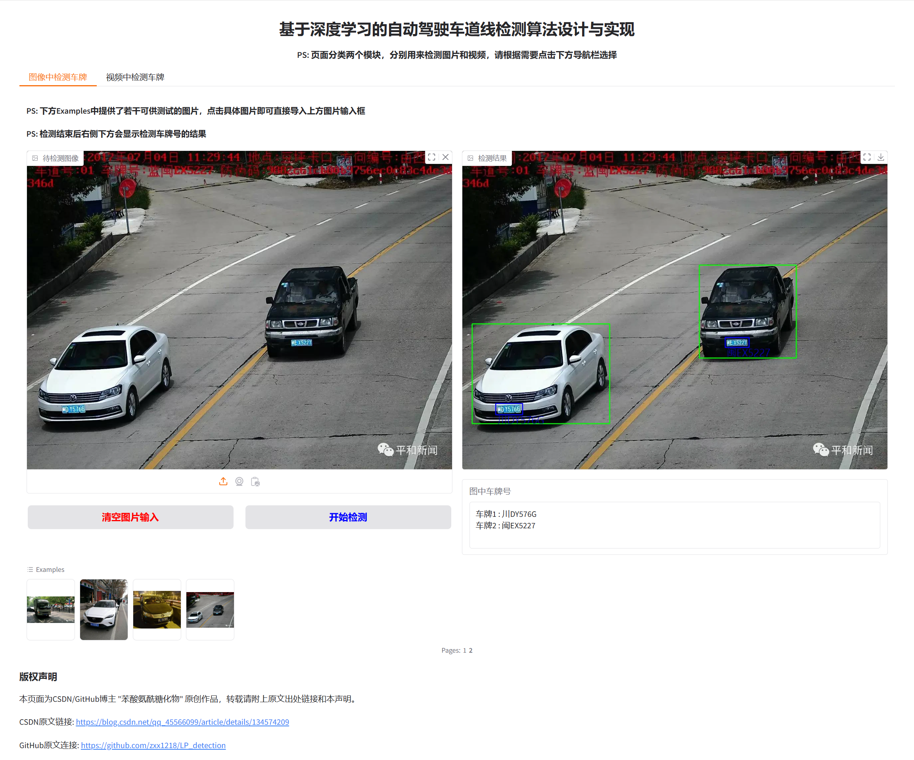
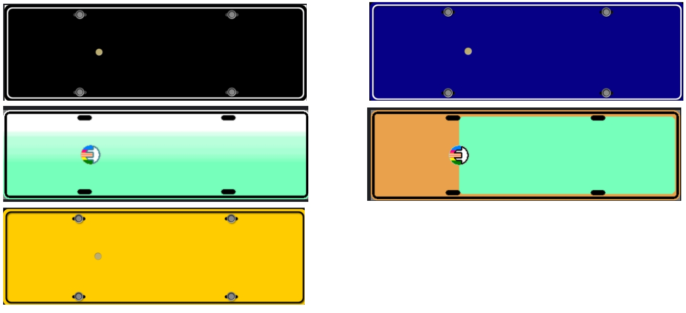
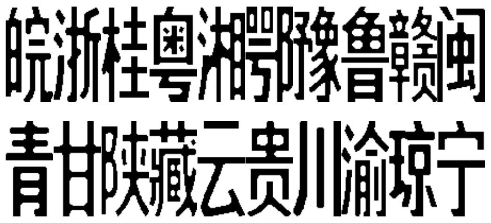
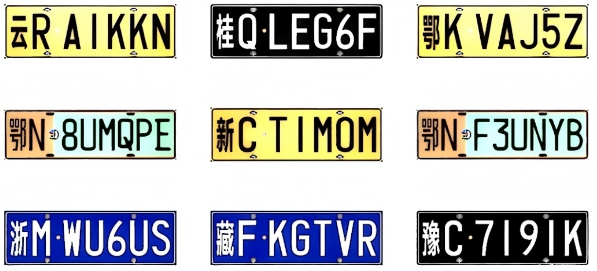
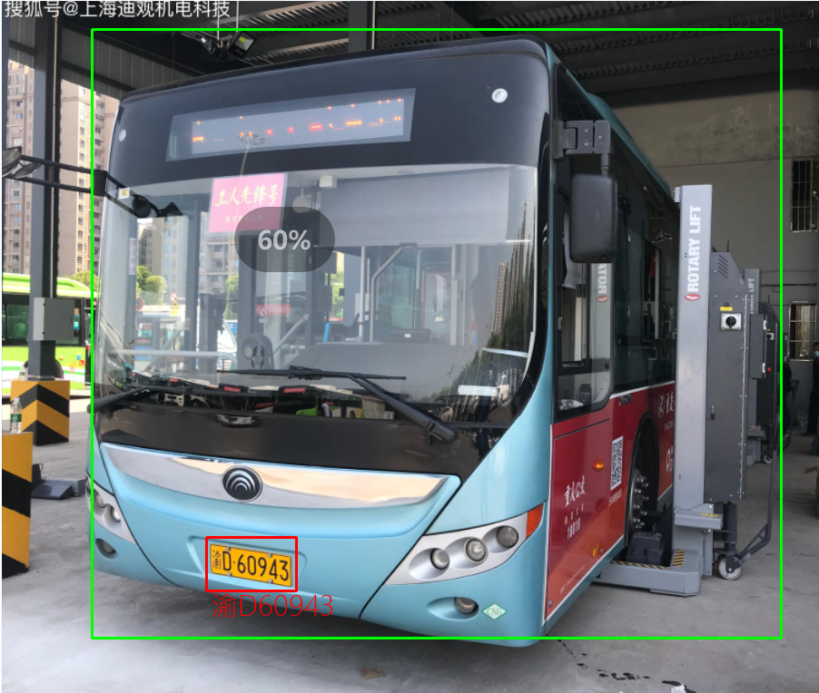

# 计算机毕业设计--基于深度学习的车牌检测与识别算法


#### 作者主页中还有其他方向的深度学习毕业设计项目，例如图像破损修复、老照片图像恢复、灰白照片色彩复原、医学图像分割等，具体参考：👇
[深度学习方向毕业设计](https://blog.csdn.net/qq_45566099/category_12507289.html)

## :sparkles: Demo


<hr>

## :sparkles: 车牌识别Web端在线体验连接

👇
 **Web端在线体验地址：**:white_check_mark:[访问这里进行车牌识别在线体验](http://zxxserver.e3.luyouxia.net:10765):white_check_mark:

PS1：在线体验地址集成了图片识别和视频检测，点击页面下方页面选项即可分别体验！在网页下方提供了若干输入样例，点击样例自动填充到相应位置后即可点击开始修复查看效果。

PS2：在线体验链接中部署的模型作者只用了少量数据进行了简单的训练，如果需要更高精度以及更好的性能，自行部署项目后可以使用更全面的数据集进行训练
☝



<hr>


## 介绍
&emsp;&emsp;本项目利用深度学习（卷积神经网络）设计了一个基于深度学习的车牌检测识别系统，适合作为本科毕业论文的研究课题。该系统提供两种检测方式：一种是对上传的图片进行车牌检测识别，另一种是通过视频流自动识别车牌和车牌信息。只需提供包含车牌的图片（无论位置或角度如何），系统即可标记图片中的车牌位置并输出车牌号码。如果你有摄像头，可以通过训练好的模型调用摄像头进行动态车牌监测，或者将.mp4格式的视频文件输入模型，模型将返回标记好车牌位置的图片并输出检测到的车牌号码。

## 模型结构设计概述
&emsp;&emsp;模型设计部分，车辆检测网络采用了改良的**YOLOv7**模型进行检测（改进方法是加入了注意力机制以及改良了原模型中的GSConv_slimneck卷积），而车牌检测网络则自行设计了一种**ResNet与Transformr**相结合的网络，该模型输出检测边框的仿射变换矩阵，可识别任意角度的车牌文字。训练数据集使用CCPD2019、2020以及部分自生成数据集。

&emsp;&emsp;在训练检测模型时，使用了数据增强方法以增强模型的泛化能力。对于车牌号码的序列识别，使用程序生成的车牌图片进行训练，并结合适当的图像增强手段。模型训练采用端到端的方式，输入图片后直接输出车牌号码序列，并将车牌号码打印在原始图片上。

## 自构建数据集
&emsp;&emsp;由于所能获取的车牌文字数据集量少且质量较差，本课题通过自动生成多样化车牌用于补充数据训练模型，如下图所示，本课题使用程序构建了不同颜色的车牌底板用于模拟国内五种车牌底色。



&emsp;&emsp;同时，如下图所示，本课题还使用程序构建了不同省份的车牌文字信息，用于模拟车牌内容文字。



&emsp;&emsp;最终，如下图所示，通过程序，本课题构建了大量的车牌信息数据集用于文字识别训练，丰富了训练数据的多样性，显著提升模型对各类复杂真实场景的适应性。



<hr>

## :rocket: 运行要求
- 运行算法与Web前端需要 Python >= 3.8
- 建议使用带有nvidia系列的显卡（比如1060、3050、3090、4090、5060都是nvidia系列的）
- 如果没有显卡该项目也可以通过CPU+内存的方式部署，平均单图推理速度约为0.7s

<hr>

## :zap:项目使用方式
#### 环境配置（推荐使用conda安装环境）
```
# 从github上Clone项目
git clone https://github.com/zxx1218/LicensePlateDetection.git

# 使用conda创建环境
conda create -n lpd python=3.9 -y
conda activate lpd

# 安装依赖
pip install -r requirements.txt 
```
## 检测展示：
在视频中检测车牌：
- 由于Github上传视频限制，请移步至我的CSDN观看：https://blog.csdn.net/qq_45566099/article/details/134574209

使用模型检测单张图片：

    

<hr>


## 作者联系方式：
- **VX：Accddvva**
- **QQ：1144968929**
- Github提供训练好的模型文件以及调用该文件测试的代码（clone代码后安装环境即可进行测试，但github上代码不包含模型源码）
- 本项目完整代码 + 远程部署服务 == **价格80RMB**


  <hr>


## 广告

- 作者于浙江某985高校就读人工智能方向研究生(CSDN已认证)，可以定制模型，并提供相应技术文档以及各种需要，只需要描述需求即可
- 人工智能、深度学习领域，尤其是计算机视觉（Computer vision，CV）方向的模型or毕业设计，只要你想得出，没有做不出
